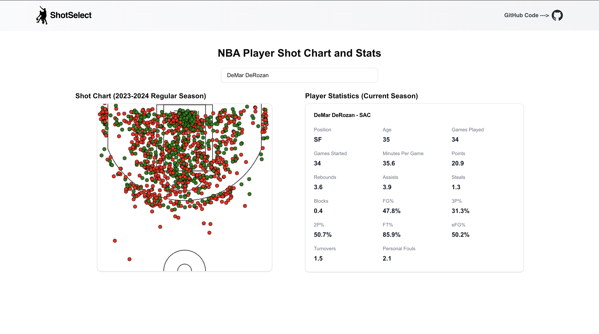

# Shot Select - NBA Player Visualization Website

An interactive platform for visualizing NBA player statistics and shot charts for the 2023-2024 season. Users can explore common player stats and visually analyze shooting performance with a clean and intuitive interface.

## Features
- **Player Statistics**: View common stats such as points, rebounds, assists, etc. from the current season.
- **Shot Charts**: Visualize player shot performance for the 2023-2024 season.
- **Search Functionality**: Quickly find players and their stats.

## Live Demo
Visit the live site: [Shot Select](https://shot-select.vercel.app)

**Note:** The site may take up to a minute to load player data initially, as the backend is hosted on Render's free plan, which may require a cold start.

## Tech Stack
- **Frontend**: Next.js, React
- **Backend**: Spring Boot, PostgreSQL
- **Hosting**: 
  - Frontend: Vercel
  - Backend: Render
  - Database: Supabase

